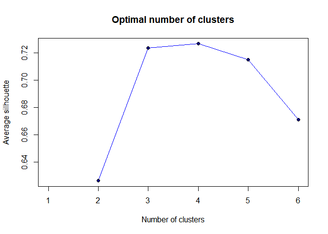

## **Introduction**
<div style="text-align: justify">
In this paper I will calculate the percentage of Warsaw's green space. In order to do that, I will use unsupervised machine learning algorithm - Clustering Large Applications algorithm. With a help of CLARA algorithm, I will do an image clustering to simplify the given image (reduce the number of colors). Then, I will calculate the share (percentage) of each color, so does the size of Warsaw's green space.</br></br>
The idea is that different urban space objects have different colors, so that they will be assigned to different groups. Therefore, buildings, roads or other artificial urban facilities will be assigned to one group, when forests, parks, trees and lawns to another.
</div>

## **Data preparation**
#### Load neccessary libraries

```r
library(jpeg)
library(rasterImage)
library(plotly)
library(cluster)
library(stringr)
```
### Raw image
<div style="text-align: justify">
Original image is a combination of screenshots of satellite images merged together. The original satellite images can be found on **[this website](https://mapa.um.warszawa.pl/mapaApp1/mapa?service=mapa)**.</br></br>
<p align="center">

</p>
</br>

### Image after changes
In order to deal with irregular shape of the satellite image (blank / white areas that are not the part of the map, but are likely to be considered and clustered as an element of infrastructure), I came up with a workaround. I changed the background color to red so that it will differ from other colors. Then, that color is going to be assigned to the separate cluster and then removed from the analysis.</br>
I also boosted contrast a bit to make colors more distinctive.</br></br>
<p align="center">

</p></div>
</br>

### Load the image
<div style="text-align: justify">
Let's read an image from a JPEG file into a raster array.
</div>

```r
warszawa <- readJPEG("waw_boost.jpg")
```

<div style="text-align: justify">
Create a dataframe containing information about the co-ordinates of each 'pixel' and its RGB color.
</div>

```r
dm1<-dim(warszawa) 
rgbImage1<-data.frame(x=rep(1:dm1[2], each=dm1[1]),
                      y=rep(dm1[1]:1, dm1[2]),
                      r.value=as.vector(warszawa[,,1]), 
                      g.value=as.vector(warszawa[,,2]),
                      b.value=as.vector(warszawa[,,3]))
```

<div style="text-align: justify">
Plot the dataframe - points and its' colors.
</div>

```r
plot(y~x, data=rgbImage1, main="Satellite view of Warsaw", col=rgb(rgbImage1[c("r.value", "g.value", "b.value")]), asp=1, pch=".", axes=FALSE, xlab="", ylab="")
```
<p align="center">

</p>
</br>

## **Clustering**
### CLARA algorithm
<div style="text-align: justify">
In order to do the clusterization, I am using CLARA algorithm. CLARA bases on k-meoids (PAM) methods and deal with data containing a large number of objects. Due to the sampling approach, computing time and RAM usage are reduced.</br>
</br>
To find the optimal number of clusters I am applying silhouette analysis to study the separation distance between the resulting clusters. Values of the silhouette width that are close to 1 imply that the instance is close to its cluster (is a part of the right cluster). The lower the silhouette width the worse. Value of -1 means that the instance is in the wrong cluster. Value of 0 means that the instance is at the boundary of the two nearest clusters.</br>
</br>
Let's look at the average silhouette width for different number of clusters (from 2 to 6).
</div>

```r
n1<-c() 
for (i in 1:6) {
  cl<-clara(rgbImage1[, c("r.value", "g.value", "b.value")], i)
  n1[i]<-cl$silinfo$avg.width
}
```

<p align="center">

</p>
</br></br>

<div style="text-align: justify">
The average silhouette suggests that the optimal number of clusters is 3 or 4 (around 0.72). Such high value of the average silhouette means that clusters will be very consistent. Optimal 3 number of clusters also corresponds with my expectations. I want to have clusters that will group points that are green areas, non green areas and the background.</br>
</br>
Thus, I am proceeding with 3 clusters.
</div>

```r
clara<-clara(rgbImage1[,3:5], 3) 
```

<p align="center">

</p>
</br>
<div style="text-align: justify">
As you can see on the plot above, the dataset is well clustered. Especially, the first cluster (responsible for the background) with the average silhouette width of 0.99. It is not surprising since the background was plain and easy clusterable.</br>
The average silhouette width of 0.72 gives me the certainty that I can proceed to a further analysis.
</br>

In the result clustering, I received a simplify satellite image of Warsaw with a limited number of colors to 3. The color of each cluster is the most common color in each group.</b>
Those colors can be quite unintuitive, let's change them.
</div>

```r
colors<-rgb(clara$medoids[clara$clustering,])

# Change red background back to white (#FE0000" to "#FFFFFF)
colors <- str_replace_all(colors,"#FE0000","#FFFFFF")

# Set color for green areas (#101300 to #4b9c19)
colors <- str_replace_all(colors,"#101300","#4b9c19")

# Set color for non green areas (#7E7F57 to #1c1c1c)
colors <- str_replace_all(colors,"#7E7F57","#1c1c1c")
```
</br>

<div style="text-align: justify">
Plot clustered image with changed colors.
</div>

```r
plot(rgbImage1$y~rgbImage1$x,col=colors,pch=".",cex=2,asp=1,main="Split into 2 types of urban area",axes=FALSE, xlab="",ylab="")
```

<p align="center">

</p>
<div style="text-align: justify">
When we compare our clustered image with the starting image. We can see that the results of clustering are pretty great. Both, green areas and non green areas are defined quite accurately and reflect the reality.
</div>

## **Results**
<div style="text-align: justify">
Take a look at the table that shows the number of occurrences of each color. I have also added column <em>type</em> for the sake of better readability.
</div>

```r
results <- as.data.frame(table(colors))
results$type <- c("Non green urban area", "Green space", "Other")
results
```

```
##    colors   Freq                 type
## 1 #1c1c1c 189555 Non green urban area
## 2 #4b9c19 212523          Green space
## 3 #FFFFFF 139934                Other
```

<div style="text-align: justify">
Based on the above information, I have created a pie chart to visualize the result.
</div>
<p align="center">

</p>

<div style="text-align: justify">
The result shows that over 50% of Warsaw's area are green spaces.</br>
</br>
Is this estimation correct? I found information ([here](https://warszawa.naszemiasto.pl/warszawa-ma-wiecej-zieleni-niz-paryz-czy-nowy-jork-dlaczego/ar/c1-4986008)) that this volume should be around 40%. However, we do not know the methodology of calculating which was used in that article. I assume that only official green spaces were counted (city parks or public gardens). Furthermore, my analysis covers some areas that are outside Warsaw[^footnote] which are often green and may bias the result. Summing up, I assume that the result is bona fide.
</div>
[^footnote]: Because of the irregular shape of the satellite image, some suburban areas were also included.
